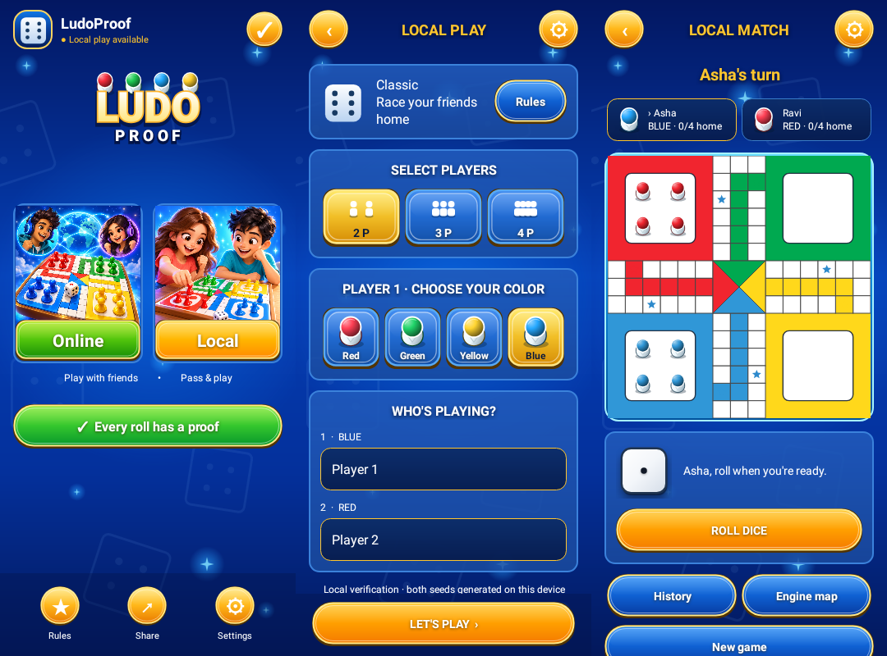

# UI and behavior review

## Reference and scope

The supplied `ludoproof.zip` contains 24 screenshots. This implementation adapts
their deep blue arcade background, gold primary actions, compact selection
panels and centered dialogs to LudoProof's existing online and local modes.
Original vector chrome and two original illustrations generated with the built-in image tool supply the artwork; third-party screenshots,
advertisements, logos and avatars are not shipped as app assets.

The reference's shop, purchases, ads, leaderboard, badges, computer opponent,
Rush and Snake & Ladder are outside the supported game feature set. No mock
balances, rankings, purchases or nonfunctional switches were introduced.

Artwork revision: illustrated mode cards, layered wordmark, glossy gold controls, pawn icons and larger board tokens. Asset paths and exact prompts are recorded in [UI_ARTWORK.md](UI_ARTWORK.md).

## Implemented flows

- **Home:** responsive mode cards, separate online/local resume actions,
  connection status, rules, fair-play explanation, share and settings.
- **Local setup:** 2–4 players, starting color, editable player names, preserved
  setup fields across activity recreation, inline validation and a fixed Play
  action above system/keyboard insets.
- **Local game:** player/turn indicators, home counts, board, dice, accessible
  token buttons, history, engine map, winner state and confirmed replacement.
- **Online:** compact create/join lobby, name/code errors visible outside the
  game-only panel, persistent draft fields, waiting room and existing host
  start/share/sync/verified roll/move/recovery paths. Concurrent requests are
  gated; network changes cannot re-enable actions during a pending operation.
- **Settings:** persisted animation speed, animation enablement and haptics.
  System reduced-motion and haptic settings are respected. These preferences
  only affect presentation, never dice derivation or server authority.
- **Shared layout:** safe insets, keyboard avoidance, growing text/button
  heights, constrained content width, scrollable dialogs and button feedback.

## Behavior fixes

- Board input requires an uninterrupted tap on a legal token. Drags, cancelled
  or multi-finger gestures, disabled input and state updates cancel selection.
- Only the owner of an active, resolved roll sees/selects legal tokens.
- Local rolls are saved before their presentation delay. Leaving during the
  animation retains the same outcome/event. Duplicate taps cannot add a roll.
- New Game confirms replacement; cancelling preserves the match.
- Home refreshes saved games when returning and supports both resume options.
- Connection availability requires validated internet access, not only Wi-Fi.

## Automated verification

The native-view tests in `ArcadeFlowTest` cover local names, roll persistence
across lifecycle transitions, replacement/cancellation, settings, lobby errors
and a narrow four-player setup. They write rendered PNGs to
`android/app/build/reports/ui/`. `BoardGestureTest` exercises Android touch
sequences; `BoardSelectionTest` checks turn/roll ownership and invalid states.
Existing local crypto and backend tests remain in place.

Final verification on 2026-10-01 (JDK 17, Gradle 8.13, Android SDK 35):

- Android: **15 tests passed**, including rendered native-view flow tests,
  gesture tests, selection rules and the existing crypto conformance tests.
- Backend: **54 tests passed**.
- `lintRelease`: **0 errors, 55 warnings**. Remaining warnings concern drawing
  allocations, localization, existing synchronous preference writes and the
  existing data-extraction configuration; they are not suppressed.
- `assembleDebug`, `assembleRelease` and `bundleRelease`: **passed**, including
  R8 release shrinking. Release artifacts are unsigned; debug APK is for testing.
- Repository security gate and `git diff --check`: **passed**.

Additional native renders: [online lobby](ui-preview/online-lobby.png),
[settings](ui-preview/settings.png),
[150% font size](ui-preview/local-setup-large-text.png).

Build artifacts (not tracked in Git):

- `android/app/build/outputs/apk/debug/app-debug.apk`
- `android/app/build/outputs/apk/release/app-release-unsigned.apk`
- `android/app/build/outputs/bundle/release/app-release.aab`

Artifact hashes are recorded in `UI_BUILD_VERIFICATION.json`.

## Device checks still needed

Robolectric rendering and lifecycle tests are not a physical-device test.
Before release, exercise TalkBack, keyboard navigation, large fonts, rotation,
cutouts and gesture/three-button navigation on supported Android versions.
Run a real multi-device online match through disconnect, resume, capture and
completion. No production deployment or store signing is part of this pass.
